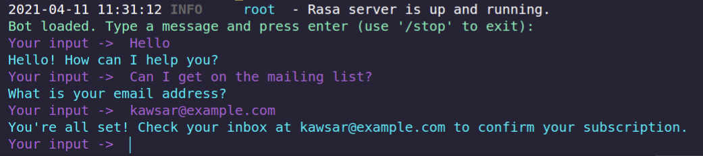
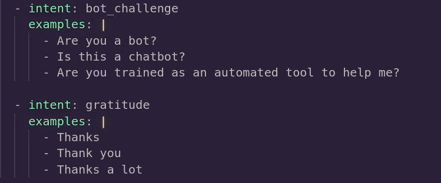
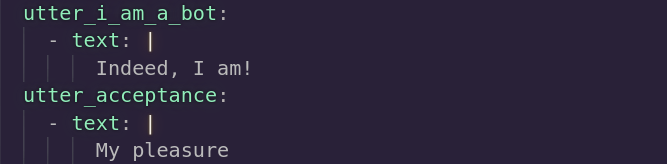
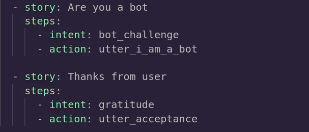
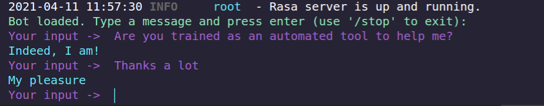

# ChatBot Using Rasa
Here I will walk you through how I created this ChatBot using Rasa from scratch

## :computer: Installation

Although it's not mandatory, I created a virtual environment so that system-wide package installation wouldn't be needed and to have the ability of installing packages without root privileges:

```bash
python3 -m venv ./venv
```
Then I activated the virtual environment using:

```bash
source ./venv/bin/activate
```
The I installed Rasa Open Source using:

```bash
pip3 install rasa
```

## :hammer: Initial Build

For the initial build of the ChatBot, I went to:

https://rasa.com/docs/rasa/playground

Here, I added some new examples "Hello" and "Can I get on your mailing list?" to intens "greet" and "subscribes" respectively. [This is not mandatory] <br/>
In plain English, each intent contains some examples which the ChatBot intends the user to give input as. <br/>

Then I checked the Responses, Stories, Forms and Rules sections respectively. Like intent, new responses, stories, forms and rules can also be added here.<br/>

Then to train the assistant, I clicked the Train button.<br/>

Then I dowloaded the project by clicking the Download Project button.<br/>

A project.zip file was downloaded which I extracted afterwards.<br/>

At that stage I was ready with the initial build of the ChatBot :ballot_box_with_check:

## :arrow_forward: Running the Initial Build

After extraction of the project.zip file, the initial build was run using:

```bash
rasa shell
```


## :gear: Adding new intents, responses and stories and Training the Model

I added two new intents *bot_challenge* and *gratitude* by adding these lines to the nlu.yml file in the data folder:



Then I added two new responses *utter_i_am_a_bot* and *utter_acceptance* by adding these lines to the domain.yml file:



Finally, I added two new stories *Are you a bot* and *Thanks from user* by adding these lines to the stories.yml file in the data folder:



The idea here is to let the bot respond according to *utter_i_am_a_bot* and *utter_acceptance* when the intent will be accoriding to *bot_challenge* and *gratitude*
respectively.

Then the model was trained using:

```bash
rasa train
```

## :arrow_forward: Running the New Build

After training was completed, the new build of the ChatBot was run using:

```bash
rasa shell
```


The new intents, responses and stories I added are working fine! :ballot_box_with_check:


